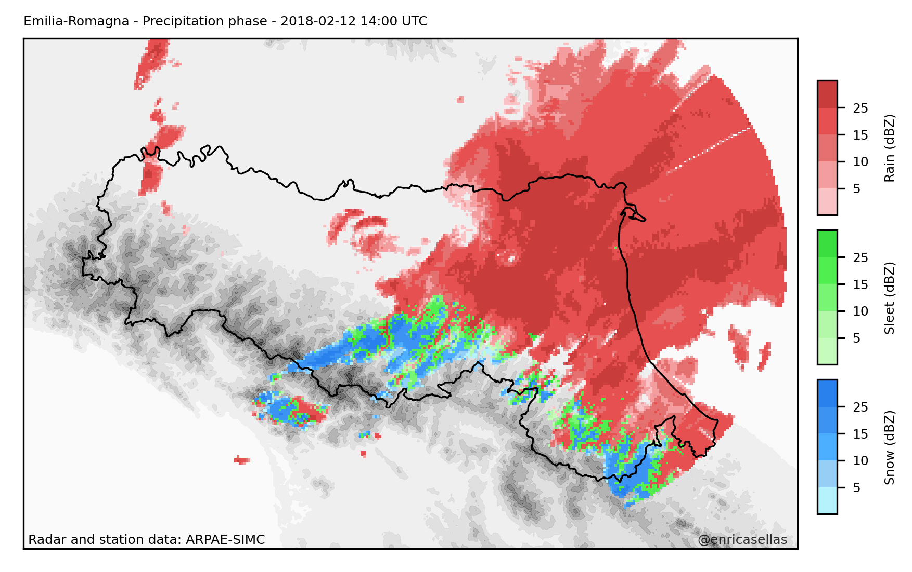

# Rain or snow?

The aim of this repository is to show examples of surface precipitation phase classification (snow, sleet and rain) using available open data from different meteorological services.

The discrimination of precipitation phase is based on already exisiting methodologies which set thresholds to surface air temperature and relative humidity fields to classify precipitation among rain, sleet and snow. These fields are obtained through interpolation of surface observations using [pyMICA](https://github.com/meteocat/pymica), a Python library specifically designed for interpolation purposes. Then, discrimination of precipitation phase is done using [pyPROS](https://github.com/meteocat/pymica), another Python library which implements different precipitation phase discrimination methodologies.

## Examples

### Emilia-Romagna
The italian region of Emilia-Romagna is encompassed between the Po river and the Apennines, and limited to the east by the Adriatic Sea. The region presents a sharp orographic transition between the extensive Po Plain and the Apennines. 

Meteorological data for this region was obtained from the Open Data service of the Agenzia regionale per la prevenzione, l'ambiente e l'energia dell'Emilia-RomagnaAgencia ([ARPAE](https://dati.arpae.it/)). 

An example of the application of one of the methodologies to ARPAE data is shown below for 12th February 2018 at 14 UTC. Data includes air temperatura and relative humidity surface observations and weather radar reflectivity fields.

